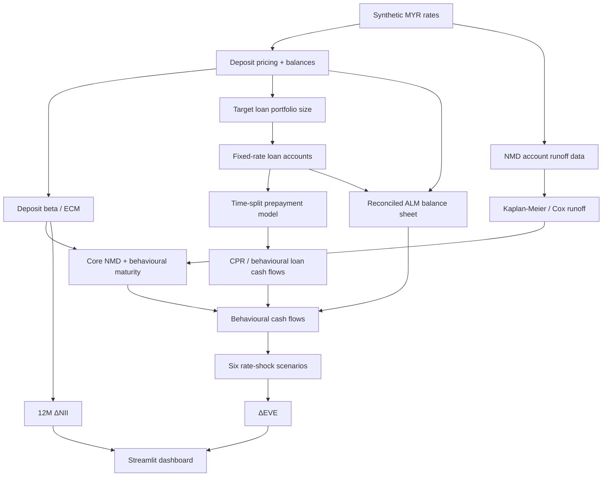

# ALM Behavioural Risk Engine

**Deposit Behaviour · Loan Prepayment · IRRBB Stress Testing**

[Live Streamlit demo](https://alm-behavioural-risk-engine.streamlit.app/)

A portfolio-quality educational prototype that simulates a miniature MYR retail bank and demonstrates how customer behaviour can change the effective interest-rate risk profile of deposits and fixed-rate loans.

> **Disclaimer:** all customer, pricing, balance-sheet and interest-rate data are synthetic. The project is Basel/BNM-inspired and is not a production banking model, regulatory submission, financial advice, or claim of regulatory compliance.

## Why this project exists

Contractual cash flows can be misleading for ALM. Non-maturity deposits (NMDs) can remain stable even though they are withdrawable on demand; deposit rates may reprice only partially when market rates move; and fixed-rate borrowers may prepay when refinancing becomes attractive. Those behaviours can materially change both Economic Value of Equity (EVE) and Net Interest Income (NII) sensitivity.

## One source of truth

The current version explicitly reconciles the modelling portfolios to the ALM balance sheet:

1. Synthetic NMD balances are generated by segment.
2. Synthetic fixed-rate loans are generated and scaled to a defined loan/NMD ratio.
3. Those exact balances are aggregated into the ALM balance sheet.
4. The same balance sheet feeds EVE, NII, repricing-gap, sensitivity and monitoring outputs.

This removes a common portfolio-demo weakness where account-level model data and the ALM balance sheet are unrelated.

## Architecture



## Quantitative methods

### Deposit pass-through

`Δr_deposit,t = α + β Δr_market,t + ε_t`

The model uses OLS with HAC/Newey-West style robust covariance and reports confidence intervals, p-values, R², Durbin-Watson and Breusch-Pagan diagnostics. An error-correction specification separates short-run repricing from the longer-run relationship.

### NMD stability / runoff

Kaplan-Meier survival estimates are paired with a Cox proportional-hazards model:

`h_i(t) = h_0(t) exp(β'X_i)`

The educational core-deposit approximation is:

`Core = Stable × (1 - Pass-through)`

and is constrained by configurable category caps used for the demonstration.

### Loan prepayment

Monthly prepayment probability is estimated using a strictly non-overlapping time split: older originations train the model and newer originations test it. Diagnostics include ROC-AUC, PR-AUC, Brier score, coefficients/odds ratios and probability-decile calibration.

`CPR = 1 - (1 - SMM)^12`

### IRRBB / EVE

`DF_i(t) = exp(-R_i(t)t)`

`EVE_i = Σ CF_i,k × DF_i(t_k)`

`ΔEVE_i = EVE_i - EVE_0`

The dashboard implements six MYR interest-rate shock paths as educational scenario assumptions and compares contractual versus behavioural views.

### Duration and convexity sanity check

`ΔP/P ≈ -D_mod Δy + 0.5 × Convexity × (Δy)^2`

A +200 bp full fixed-rate loan revaluation is compared against duration-only and duration-plus-convexity approximations as an independent mathematical check.

## Reproducible headline outputs

With the default fixed random seed, the current build produces approximately:

- NMD deposits: **RM 10.94bn**
- Modelled fixed-rate loans: **RM 9.30bn**
- Loan/NMD ratio: **85%**
- Baseline portfolio CPR: **16.2%**
- Out-of-time prepayment ROC-AUC: **0.689**
- Prepayment Brier score: **0.012**
- Worst ΔEVE: approximately **RM -82m** in the current synthetic run
- Automated validation: **17 PASS / 1 WARNING / 0 FAIL**
- Pytest suite: **29 tests passing**

The single warning is intentionally visible: the low-beta retail transactional segment has weak short-run statistical significance in the synthetic sample. The project does not hide imperfect model diagnostics.

## Dashboard pages

- Executive Summary
- Portfolio Reconciliation
- Deposit Beta / ECM
- NMD Stability / Cox Runoff
- Loan Prepayment
- IRRBB / EVE + duration/convexity sanity check
- NII Sensitivity
- Contractual vs Behavioural Repricing Gap
- Behavioural Assumption Sensitivity
- Model Monitoring
- Automated Validation Controls
- Methodology & Limitations

## Validation and testing

The dashboard distinguishes developer/model-owner technical controls from independent bank model validation. Current automated controls cover portfolio reconciliation, accounting identity, deposit-beta plausibility/order, NMD caps, out-of-time split integrity, prepayment metrics, CPR/SMM arithmetic, scenario completeness, EVE completeness and principal cash-flow reconciliation.

The repository includes 29 pytest checks across mathematical identities, portfolio reconciliation, model behaviour, EVE calculations, cash-flow reconciliation and duration/convexity approximation.

## Run locally

```bash
pip install -r requirements.txt
streamlit run app.py
```

Run tests:

```bash
python -m pytest -q
```

Optional demo database:

```bash
python scripts/build_database.py
```

## What I would improve with real bank data

A production development process would require much more than this portfolio prototype, including data lineage and quality controls, granular product contractual terms, richer macroeconomic and customer features, independent validation, stability and back-testing frameworks, formal model governance, hedging and basis-risk treatment, optionality modelling, management actions, challenger models and implementation/UAT evidence against production systems.

## Limitations

- Synthetic data have no real-world predictive validity.
- Product mechanics and cash-flow generation are simplified.
- No hedging book, CSRBB, automatic-option valuation, basis-risk decomposition or management actions.
- NII treatment is intentionally simplified.
- Automated controls are not independent model validation.
- The code does not constitute an approved regulatory implementation.

## Interview summary

> I built a synthetic ALM behavioural risk engine that estimates deposit rate pass-through and NMD stability, models fixed-rate loan prepayment with an out-of-time logistic model, converts those behavioural assumptions into reconciled cash flows, and measures their impact under six interest-rate shocks using ΔEVE and 12-month ΔNII. I also built portfolio reconciliation, statistical diagnostics, automated validation controls, 29 unit tests and an interactive Streamlit dashboard.
