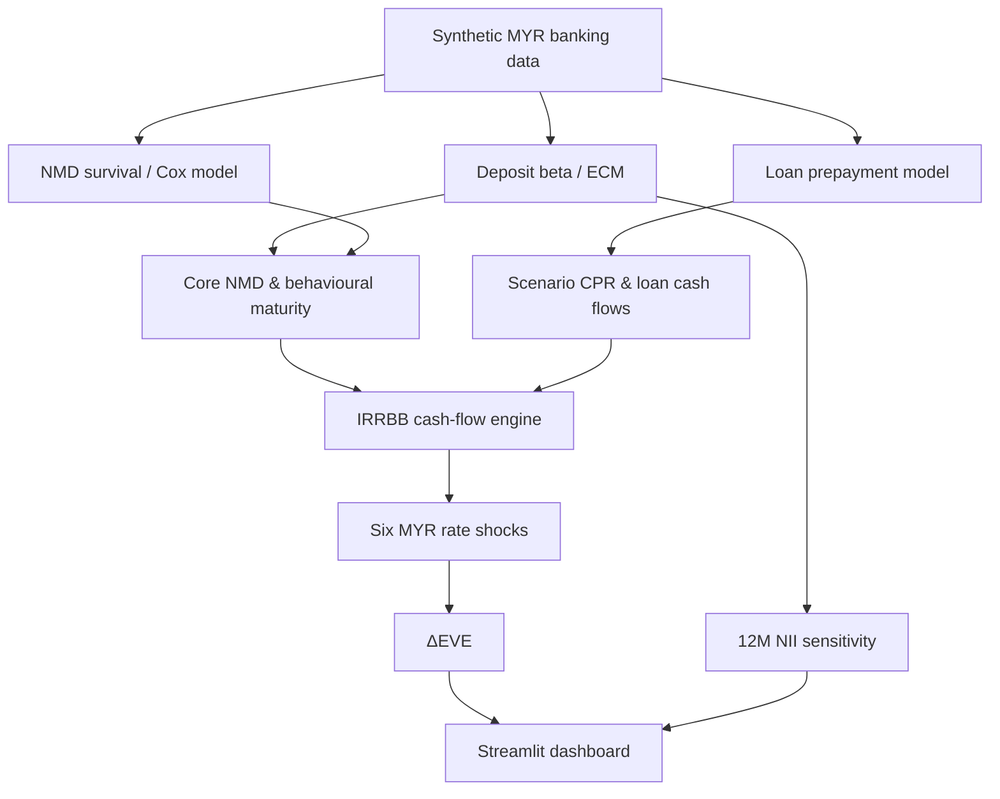

# ALM Behavioural Risk Engine

**Deposit Behaviour · Loan Prepayment · IRRBB Stress Testing**

A portfolio-quality educational prototype that simulates a miniature Malaysian retail bank and demonstrates how customer behaviour changes the effective interest-rate risk profile of deposits and fixed-rate loans.

> **Disclaimer:** all customer, pricing, balance-sheet and interest-rate data are synthetic. The project is Basel/BNM-inspired and is not a production banking model, regulatory submission, financial advice, or claim of regulatory compliance.

## Why this project exists
Contractual cash flows can be misleading for ALM. Non-maturity deposits can remain stable for years even though they are withdrawable on demand; deposit rates may reprice only partially when market rates move; and fixed-rate borrowers may prepay when refinancing becomes attractive. Those behaviours can materially change both EVE and NII sensitivity.

## Architecture


## Quantitative methods

### Deposit pass-through
`Δr_deposit,t = α + β Δr_market,t + ε_t`

The project also estimates an error-correction specification to separate short-run repricing from the longer-run relationship.

### NMD survival / runoff
Kaplan-Meier survival estimates are paired with a Cox proportional-hazards model:

`h_i(t) = h_0(t) exp(β'X_i)`

The core-deposit demonstration uses:

`Core = Stable × (1 - Pass-through)`

and then applies category caps used in the September 2025 BNM IRRBB Exposure Draft demonstration mode.

### Loan prepayment
Monthly prepayment probability is estimated with a time-split logistic model. Monthly mortality is converted to CPR using:

`CPR = 1 - (1 - SMM)^12`

Scenario CPR follows `CPR_i = min(1, γ_i × CPR_0)` using the six BNM Exposure Draft scenario multipliers.

### IRRBB / EVE
`DF_i(t) = exp(-R_i(t)t)`

`EVE_i = Σ CF_i,k × DF_i(t_k)`

`ΔEVE_i = EVE_i - EVE_0`

The dashboard implements the six MYR shock paths in Appendix 5 of BNM's 30 September 2025 IRRBB Exposure Draft.

## Features
- Reproducible synthetic MYR rate history
- Three NMD segments: retail transactional, retail non-transactional and wholesale
- Deposit beta with HAC standard errors
- Error-correction model
- Kaplan-Meier deposit survival curves
- Cox runoff model
- Core NMD / behavioural maturity estimates
- Time-split loan prepayment model
- CPR / SMM conversion and scenario multipliers
- Six MYR IRRBB yield-curve shocks
- Discounted-cash-flow EVE and ΔEVE
- Simplified 12-month NII sensitivity
- Streamlit dashboard
- SQLite build script
- Automated pytest checks
- Model development and UAT documentation

## Run locally
```bash
pip install -r requirements.txt
streamlit run app.py
```

Run tests:
```bash
python -m pytest -q
```

Optional demo database:
```bash
python scripts/build_database.py
```

## Regulatory context
The project references the **Bank Negara Malaysia Exposure Draft on Interest Rate Risk in the Banking Book, issued 30 September 2025**, which remained listed by BNM as an Exposure Draft when this portfolio was built. It is used only to shape an educational demonstration of NMD categories/caps, prepayment stress multipliers and six MYR interest-rate scenarios.

Basel's IRRBB framework similarly highlights behavioural optionality in NMDs and fixed-rate loans subject to prepayment risk.

## Limitations
- Synthetic data have no real-world predictive validity.
- Product mechanics and cash-flow generation are simplified.
- No hedging book, CSRBB, automatic-option valuation, basis-risk decomposition or management actions.
- NII treatment is intentionally simplified.
- The code does not constitute an approved regulatory implementation.

## Interview summary
> I built a synthetic ALM behavioural risk engine that estimates deposit rate pass-through and NMD stability, models fixed-rate loan prepayment, converts those behavioural assumptions into cash flows, and measures their impact under six IRRBB rate shocks using ΔEVE and 12-month NII sensitivity. I also added out-of-time validation, automated tests and an interactive Streamlit dashboard.
